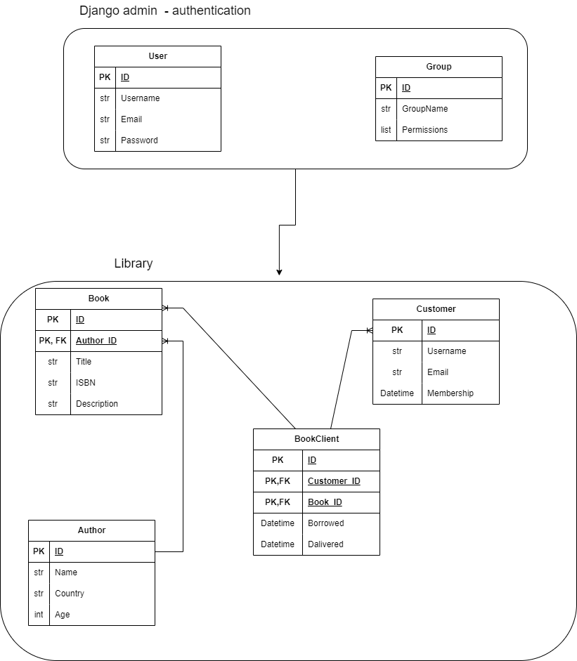

# Library manage by Django admin site

This library project is managed only through the Django admin site. It does not contain any views and showcases how to implement advanced features built into the Django admin site.

## Content

- [Library manage by Django admin site](#library-manage-by-django-admin-site)
  - [Content](#content)
  - [About this project](#about-this-project)
    - [Purpose](#purpose)
    - [Design](#design)
    - [Out of scope](#out-of-scope)
  - [Requirements - Technologies](#requirements---technologies)
  - [Installation](#installation)

## About this project

The project is a system for a library some of the main operations that can be performed are

- Add authors
- Add books
- Borrow books
- Register customers
- Return books

These operations will require an authorization level to be performed for example

Librarian: Can add, delete and update books, authors, customers, and also borrow books from the library

Employee: Can only consult for information and cannot perform any update or delete instances

### Purpose

The main purpose of this project is to show how to implement a admin site through Django admin site. You will find in this project how to implement advanced models authentication, multiple relations, Admin site with groups and access layers.

### Design

### Out of scope

The project doesn't contemplate some aspect such as:

- A dedicated view to perform operations
- A dedicated authentication form
- API architecture since we are only using Django admin site

## Requirements - Technologies

The requirements for this project are only python3.8 or higher and Django 4 or higher

## Installation

To install and use this project on your local computer you can follow this steps
Note: You must have installed Django, Python, and preferably a virtual environment

1- git clone <https://github.com/brandoncode01/library_admin_panel.gita>
2- cd library_admin_panel
3- pip install requirements.txt
4- python manage.py runserver
